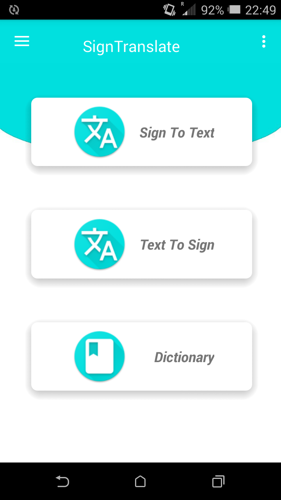
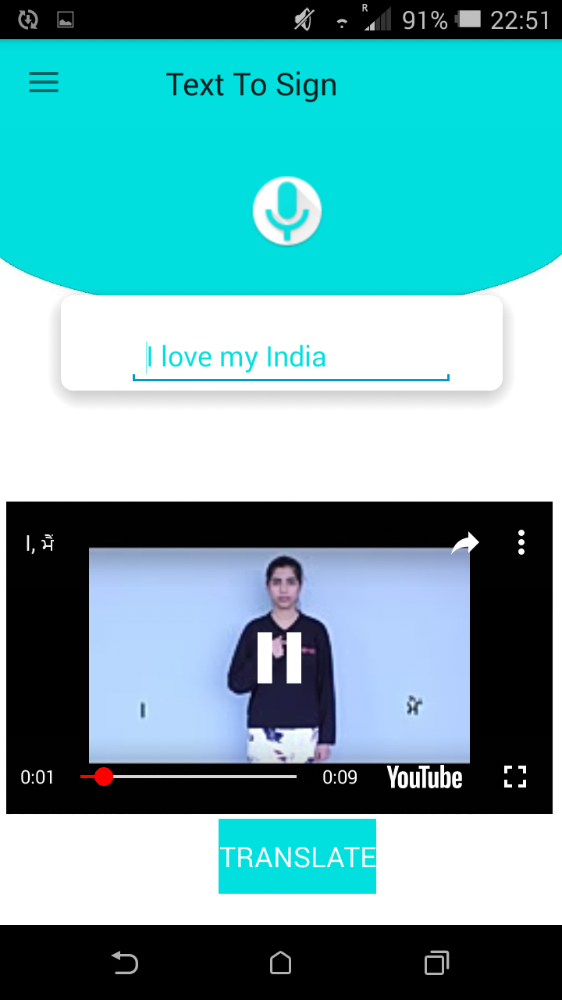
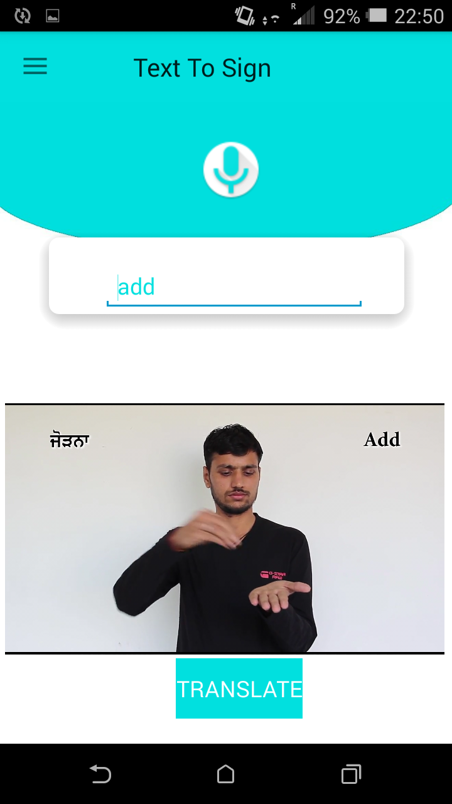
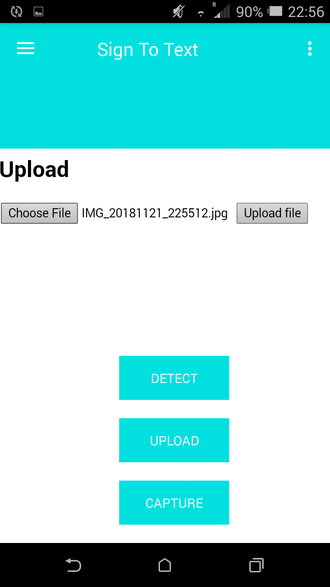
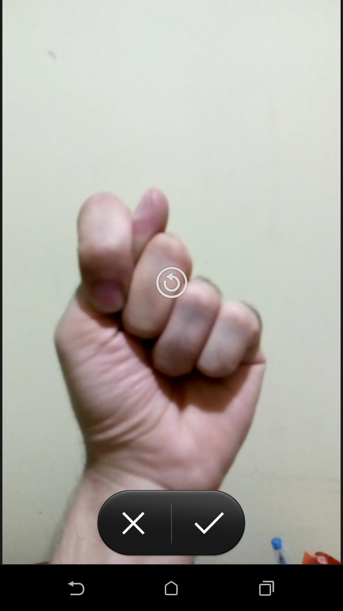
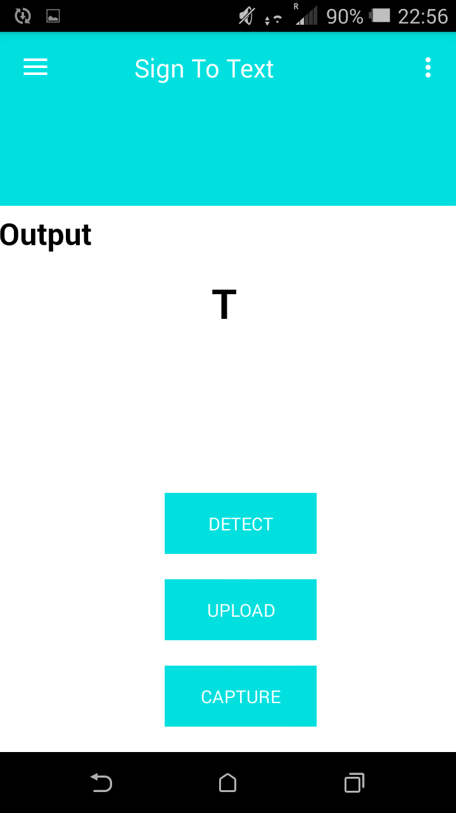
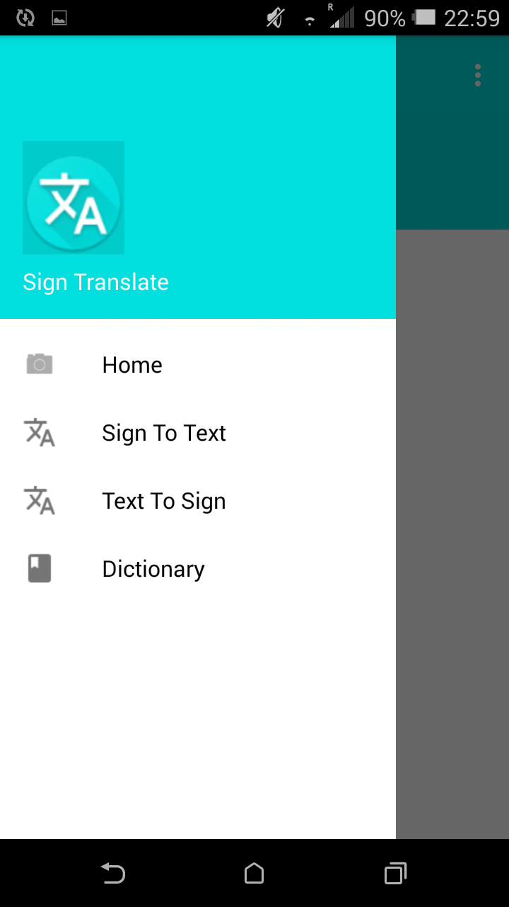
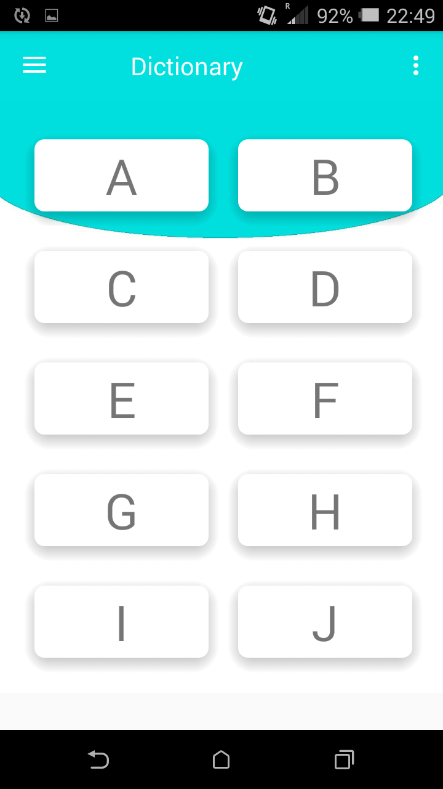
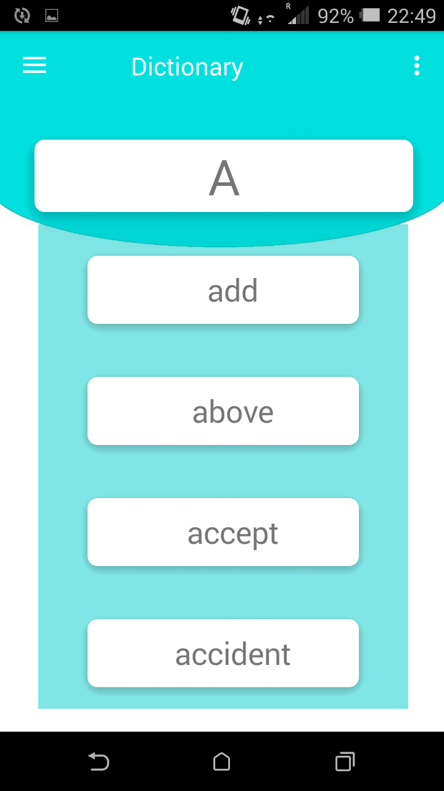

# SignTranslate
An app for helping deaf and dumb people to communicate. It uses machine
learning to translate American Sign Language signs to text. It also provides a
dictionary and tutorials for learning sign language using Youtube API.
SignTranslate shows the conversion of a sentence into signs through wordby-word videos of corresponding signs.

